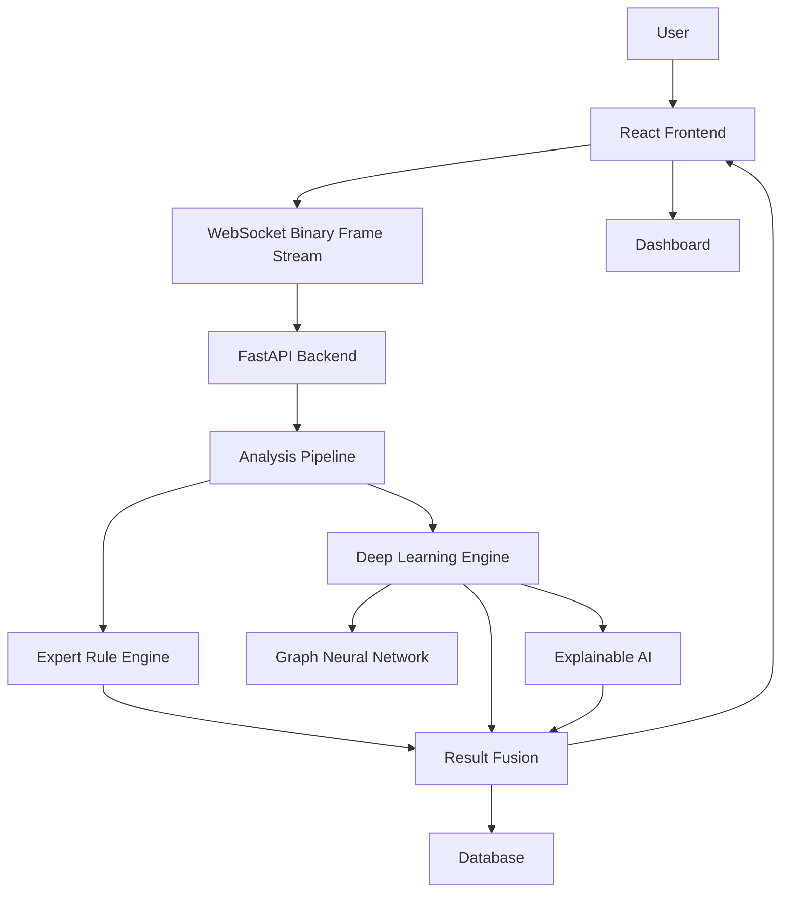
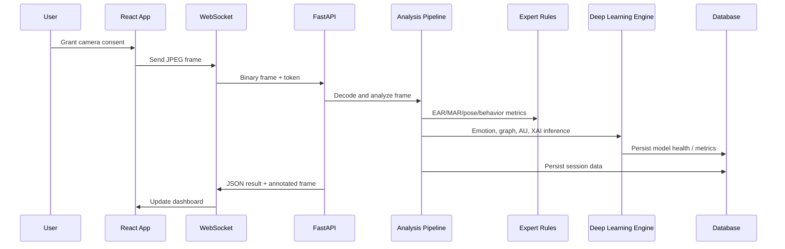
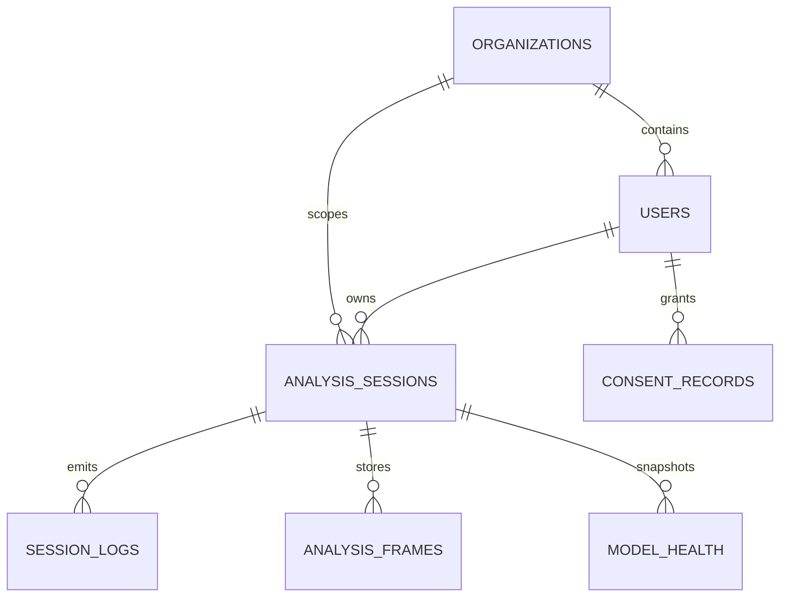

# AUTHFACEGRAPH AI

**AuthBrain AI Face Analysis Engine**

A privacy-first, real-time facial behavior analysis platform that combines classical computer vision, expert rules, deep learning, graph neural networks, and explainable AI in a React + FastAPI system.

This document is both a developer guide and a technical architecture report. It is written for GitHub, research handover, software engineering documentation, and thesis appendix use.

---

## Table of Contents

1. [Project Overview](#project-overview)
2. [Overall System Architecture](#overall-system-architecture)
3. [Technology Stack](#technology-stack)
4. [Folder Structure](#folder-structure)
5. [Complete Processing Pipeline](#complete-processing-pipeline)
6. [Deep Learning Architecture](#deep-learning-architecture)
7. [Graph Neural Network](#graph-neural-network)
8. [Expert Rule Engine](#expert-rule-engine)
9. [Explainable AI](#explainable-ai)
10. [Model Ensemble](#model-ensemble)
11. [Database Design](#database-design)
12. [WebSocket Communication](#websocket-communication)
13. [Dashboard Components](#dashboard-components)
14. [Configuration](#configuration)
15. [Performance Optimization](#performance-optimization)
16. [Security](#security)
17. [Testing](#testing)
18. [Installation](#installation)
19. [API Documentation](#api-documentation)
20. [Future Work](#future-work)
21. [References](#references)

---

## Project Overview

### Introduction

AUTHFACEGRAPH AI is a real-time face analysis platform for webcam-driven observation of facial behavior, attention, fatigue, and emotion. The system streams frames from a browser to a backend inference pipeline, performs landmark detection and signal extraction, then combines deterministic rules with learned models to produce explainable per-frame outputs.

The project is organized as an enterprise-style full stack system:

- React frontend for live capture and dashboards
- FastAPI backend for analysis and streaming
- MediaPipe Face Mesh for 478-landmark geometry
- Classical physiological analyzers for EAR, MAR, gaze, head pose, and smile
- Deep learning emotion models for image-based inference
- Graph neural networks for facial landmark relational reasoning
- Explainable AI for model and rule transparency
- Database persistence for sessions, metrics, and logs

### Motivation

Most webcam-based facial analytics systems fail for one or more of the following reasons:

- They rely on a single model and produce brittle results.
- They ignore geometric signals such as eyes, mouth, and head pose.
- They show model output without explaining why it happened.
- They do not track temporal behavior.
- They do not separate classical CV reliability from learned model uncertainty.
- They do not gate weak models or detect bad inputs.

This project addresses those weaknesses by combining multiple inference layers, confidence-aware decision logic, and a research-oriented visualization stack.

### Research Objectives

The platform is designed to study and operationalize the following questions:

- Can facial emotion recognition be made more reliable under live webcam conditions?
- Can a hybrid system outperform a single deep model by combining rules, CNNs, and graph reasoning?
- Can explainability be built into the pipeline rather than added afterward?
- Can uncertainty and disagreement be tracked explicitly for real-time inference?
- Can facial behavior be analyzed without requiring biometric storage or identity recognition?

### Problems Addressed

- Webcam frames arrive with inconsistent lighting, pose, and compression artifacts.
- Pretrained emotion models can misclassify smiling faces under domain mismatch.
- A single classifier has no explicit mechanism to detect uncertainty.
- GNN overlays can become visually unreadable if scaling is not controlled.
- Many systems lack auditable rule-based outputs for safety and debugging.
- Temporal behavior is often ignored even though it matters for fatigue and attention.

### Key Innovations

- Hybrid architecture combining rules, CNNs, GNNs, and XAI.
- 478-landmark graph representation of the face.
- Geometric Action Unit estimation from facial landmarks.
- Dynamic result fusion with agreement and disagreement measurement.
- Explicit confidence handling and low-confidence gating.
- Live WebSocket transport for low-latency inference feedback.
- Research-mode dashboard for node-level and edge-level visualization.

### Features

- Real-time webcam capture in the browser.
- FastAPI WebSocket backend for binary JPEG frame streaming.
- MediaPipe Face Mesh with 478 landmarks.
- Eye Aspect Ratio, Mouth Aspect Ratio, gaze, head pose, and smile estimation.
- Expert rule engine for fatigue, focus, and alert classification.
- HSEmotion emotion recognition.
- EfficientFace model integration framework.
- Graph Attention Network and Graph Convolution baseline support.
- Geometric Action Unit estimation.
- Explainable AI outputs for landmarks and rules.
- Dashboard with emotion, metrics, timeline, and GNN visualization.
- Session persistence and log storage.

### System Capabilities

- Frame-by-frame inference over WebSocket.
- Multiple model outputs with confidence and uncertainty tracking.
- Per-session metrics and summary statistics.
- Debug inference artifacts written to disk.
- Model health tracking and latency reporting.
- Optional GNN inference controlled by checkpoint availability.
- Frontend research mode for graph interrogation.

---

## Overall System Architecture

### End-to-End Flow



### High-Level Component Diagram

```text
+-------------------+       +------------------------+
| React Frontend    |       | FastAPI Backend        |
|-------------------|       |------------------------|
| Camera capture    |<----->| WebSocket endpoint     |
| Dashboard UI      |       | Auth/session API       |
| Research mode     |       | Analysis pipeline      |
| Canvas visualizer |       | Model registry         |
+-------------------+       | Expert rules           |
                            | DL engine              |
                            | DB persistence         |
                            +------------------------+
```

### Backend Runtime Architecture



### Architectural Notes

- The frontend does not perform the core inference; it only captures and displays frames.
- The backend is the authoritative inference layer.
- The pipeline is intentionally modular so classical CV, rules, and learned models can evolve independently.
- The GNN is checkpoint-gated to prevent random or untrained graph predictions from being surfaced as valid output.

---

## Technology Stack

| Layer | Technology | Why It Was Selected |
|---|---|---|
| Frontend | React 18 + TypeScript | Strong component model, type safety, and maintainable dashboard code |
| Frontend build | Vite | Fast local development and production build performance |
| Styling | Tailwind CSS | Utility-driven UI assembly for dense scientific dashboards |
| Charts | Recharts | Stable, flexible charting for time-series and probability plots |
| State | Zustand | Lightweight global state for streaming analysis data |
| Backend | FastAPI | High-performance async API and WebSocket support |
| ASGI server | Uvicorn | Simple production-ready server for FastAPI |
| Computer Vision | OpenCV | Frame decode, crop, geometry, and image processing |
| Landmark detection | MediaPipe Face Mesh | 478 landmark extraction with production-grade runtime |
| Emotion recognition | HSEmotion ONNX | Low-latency webcam emotion classification |
| Emotion alternative | EfficientFace | Pluggable CNN architecture for research and benchmarking |
| Graph learning | PyTorch Geometric | Native graph neural network tooling |
| ML framework | PyTorch | Flexible training and inference for graph and CNN models |
| Explainability | Custom XAI + GNN attention | Human-readable feature attribution and graph saliency |
| Database | SQLite / PostgreSQL | Local development and production persistence |
| ORM | SQLAlchemy Async | Type-safe persistence with async backend support |
| Auth | JWT | Secure session and WebSocket access control |
| Networking | WebSocket | Low-latency live frame transport |
| Testing | PyTest | Unit, integration, and behavior tests |
| Deployment | Docker / docker-compose | Reproducible multi-service deployment |

### Selection Rationale

The stack is intentionally split between real-time systems tooling and research tooling. FastAPI and WebSocket are used for live inference. PyTorch and PyTorch Geometric provide the model experimentation layer. React and Tailwind provide a responsive scientific dashboard. SQLite supports local development, while PostgreSQL supports production and longer-lived session analytics.

---

## Folder Structure

### Top-Level

- `backend/` - FastAPI backend, analysis pipeline, models, and tests.
- `frontend/` - React dashboard and webcam interface.
- `models/` - MediaPipe task file and model assets.
- `docker-compose.yml` - Multi-service orchestration.
- `start.sh` - Convenience script to launch backend and frontend.
- `Makefile` - Task shortcuts for development workflows.

### Backend Modules

#### `backend/app/main.py`
FastAPI application entry point. Registers routers, middleware, and lifespan handling.

#### `backend/app/analysis/`
Classical computer vision and behavioral analysis.

- `pipeline.py` - Main per-frame orchestrator.
- `face_detector.py` - MediaPipe Face Mesh wrapper and face crop extraction.
- `eye_analyzer.py` - EAR, blink count, closure duration, gaze direction.
- `mouth_analyzer.py` - MAR, smile intensity, yawn logic.
- `head_pose.py` - Head pose estimation from canonical 3D landmarks.
- `behavior_tracker.py` - Temporal stability and behavior history.
- `quality_scorer.py` - Face quality estimation.
- `landmark_indices.py` - Landmark constants.

#### `backend/app/dl/`
Deep learning subsystem.

- `base.py` - Abstract model interfaces and data structures.
- `registry.py` - Model registration and lifecycle management.
- `engine.py` - Orchestrates model loading, inference, fusion, and outputs.
- `emotion/` - Emotion recognition models and ensemble logic.
- `graph/` - Graph construction and GNN architectures.
- `action_units/` - FACS-style action unit estimation.
- `xai/` - Graph explanation and attribution utilities.

#### `backend/app/expert_system/`
Rule-based decision layer.

- `rules.py` - Deterministic rules and risk classifications.
- `scorer.py` - Composite fatigue, focus, and confidence scoring.
- `explainer.py` - Human-readable explanations for rules and signals.

#### `backend/app/api/`
REST and WebSocket routes.

- `routes/` - Auth, sessions, models, consent, health.
- `websocket/` - Frame transport and response handling.

#### `backend/app/core/`
Infrastructure and platform concerns.

- `config.py` - Environment variables and settings.
- `database.py` - Async DB connectivity and session management.
- `logging.py` - Structured logging.
- `security.py` - JWT and auth helpers.

#### `backend/app/models/`
Contracts and persistence models.

- `schemas.py` - Pydantic API schemas.
- `db_models.py` - SQLAlchemy tables.

#### `backend/app/utils/`
Shared utilities.

- `frame_utils.py` - JPEG conversion, resizing, image drawing.
- `math_utils.py` - Geometry and confidence utilities.
- `calibration.py` - Confidence calibration helpers.

#### `backend/tests/`
PyTest unit and integration tests for the analysis and model stack.

### Frontend Modules

#### `frontend/src/components/webcam/`
- `CameraFeed.tsx` - Live video capture and stream control.
- `PrimaryAIVisualizer.tsx` - Research-mode face graph visualizer.

#### `frontend/src/components/dashboard/`
- `MetricsPanel.tsx` - Summary analytics and metric cards.
- `EnsemblePanel.tsx` - Model selection and ensemble inspection.
- `EmotionRadarChart.tsx` - Emotion distribution radar.
- `EmotionTimelineChart.tsx` - Temporal emotion evolution.
- `ActionUnitsPanel.tsx` - AU intensities.
- `SystemLogs.tsx` - Event and diagnostic logs.
- `TopBar.tsx`, `LeftSidebar.tsx`, `RightPanel.tsx` - Dashboard layout.

#### `frontend/src/store/`
- `index.ts` - Zustand store and live analysis state.

#### `frontend/src/services/`
- `websocket.ts` - Binary frame sending and message handling.

#### `frontend/src/pages/`
- `ConsentPage.tsx` - User consent gate.
- `Dashboard.tsx` - Main analysis dashboard.

---

## Complete Processing Pipeline

### Step 1. User Login

The user authenticates and obtains a JWT access token. The session is associated with a session ID and consent state.

**Input:** credentials, consent metadata
**Output:** authenticated session context

### Step 2. Camera Capture

The browser requests webcam access via `getUserMedia()` and begins frame capture.

**Input:** device camera stream
**Output:** video element frames

### Step 3. Frame Processing

The frontend captures frames using an off-screen canvas, compresses them to JPEG, and transmits them over WebSocket.

**Input:** video frame
**Output:** JPEG blob

### Step 4. MediaPipe Face Detection

The backend decodes JPEG bytes to BGR and runs MediaPipe Face Landmarker.

**Input:** JPEG bytes
**Output:** one or more faces with 478 landmarks

### Step 5. 478 Landmark Extraction

Each face is represented as a normalized landmark set.

**Input:** detected face landmarks
**Output:** landmark array, bounding box, pixel coordinates

### Step 6. Classical Feature Extraction

Classical physiological signals are computed from landmarks:

- EAR - Eye Aspect Ratio
- MAR - Mouth Aspect Ratio
- Head pose
- Blink count
- Gaze direction
- Smile intensity
- Behavior stability

**Input:** landmark set, prior frame state
**Output:** structured eye, mouth, head, behavior, and quality metrics

### Step 7. Expert Rule Engine

Deterministic rules classify fatigue, focus, and risk.

**Input:** EAR, MAR, head pose, behavior, quality
**Output:** attention state, fatigue score, focus score, alerts

### Step 8. Deep Learning Models

Emotion models run on the face crop, and optional graph models operate on the landmark graph.

**Input:** aligned face crop, graph data
**Output:** emotion probabilities, node importance, edge attention, AU metrics

### Step 9. Graph Construction

The 478 landmarks become a graph with nodes, features, and edges.

**Input:** landmark coordinates
**Output:** `FaceGraph`

### Step 10. Graph Neural Network

The graph is passed to the GNN when a trained checkpoint exists.

**Input:** face graph
**Output:** graph-level emotion prediction and graph attributions

### Step 11. Action Unit Estimation

Geometric AU estimators compute FACS-style units.

**Input:** landmarks
**Output:** AU presence and intensity

### Step 12. Explainable AI

The system produces explanations from GNN attention, node importance, and rule outputs.

**Input:** model outputs, rules, AU metrics
**Output:** textual and visual explanations

### Step 13. Result Fusion

Outputs are fused into a final frame result.

**Input:** expert system, DL models, GNN, AU, quality
**Output:** consolidated analysis payload

### Step 14. WebSocket Response

The backend sends JSON and binary responses back to the browser.

**Input:** fused result
**Output:** JSON analysis + annotated frame

### Step 15. Dashboard Visualization

The frontend updates the dashboard, timelines, charts, and the research HUD.

**Input:** WebSocket payload
**Output:** live UI state

---

## Deep Learning Architecture

### 1. HSEmotion

**Purpose**

Primary webcam emotion model for real-time facial emotion classification.

**Architecture**

HSEmotion uses an EfficientNet-style backbone trained on AffectNet-8 and deployed through ONNX.

**Input**

- RGB face crop
- Size: 224 × 224

**Output**

- 8-class emotion probabilities
- Calibrated top-1 confidence
- Raw confidence

**Dataset**

AffectNet-8.

**Pretraining**

Trained externally by the model authors; loaded through `hsemotion-onnx`.

**Advantages**

- Fast inference
- Good baseline accuracy
- Easy to deploy

**Limitations**

- Sensitive to domain mismatch
- Can misclassify smiling faces under poor crop orientation or lighting
- Confidence is not an absolute correctness guarantee

**Inference Pipeline**

1. Convert RGB crop to BGR.
2. Run emotion prediction.
3. Convert logits to probabilities.
4. Calibrate probabilities.
5. Return `EmotionPrediction`.

**Latency**

Typically low tens of milliseconds on CPU, depending on crop and hardware.

**Memory Usage**

Moderate. ONNX runtime is significantly lighter than a full training stack.

---

### 2. EfficientFace

**Purpose**

Alternative CNN-based emotion model for benchmarking and research.

**Architecture**

EfficientNet-B0-style backbone with a classification head.

**Input**

224 × 224 face crop.

**Output**

Emotion probabilities and top-1 label.

**Dataset**

AffectNet-8 pretrained checkpoint expected.

**Pretraining**

Fine-tuned weights are expected from Hugging Face or local cache.

**Advantages**

- Strong research baseline
- Pluggable architecture
- Easier to train/fine-tune than legacy models

**Limitations**

- The repository currently expects a valid fine-tuned checkpoint.
- If no checkpoint is available, the model load fails rather than silently producing fake outputs.

**Inference Pipeline**

1. Preprocess RGB crop.
2. Normalize.
3. Forward pass through CNN.
4. Softmax to class probabilities.

**Latency**

Depends on checkpoint and backend environment.

**Memory Usage**

Higher than HSEmotion due to PyTorch runtime overhead.

---

### 3. Graph Attention Network

**Purpose**

Learn relational facial behavior from landmark geometry.

**Architecture**

- Input: 478 nodes with 10-dimensional features
- Several GATv2 layers
- Global mean pooling
- Classification head for emotion prediction

**Input**

Face graph generated from landmarks.

**Output**

- Emotion class
- Confidence
- Probability distribution
- Node importance
- Edge attention

**Dataset**

Designed for facial landmark graph training on emotion datasets such as AffectNet or RAF-DB.

**Pretraining**

A real checkpoint is required. The repository now gates GNN loading on checkpoint availability.

**Advantages**

- Captures spatial facial relations
- More interpretable than a black-box CNN alone
- Suitable for research on landmark dynamics

**Limitations**

- Requires trained weights to be useful
- More sensitive to graph construction quality
- More expensive than simple rules

**Inference Pipeline**

1. Convert landmarks to graph.
2. Encode node features.
3. Run attention layers.
4. Pool node embeddings.
5. Predict emotion.
6. Extract attention and importance.

**Latency**

Depends on graph density and hardware.

**Memory Usage**

Higher than classical rule-based analysis.

---

### 4. Graph Convolution Network

**Purpose**

Baseline GNN architecture for ablation and comparative research.

**Architecture**

- Graph convolution layers
- Global pooling
- Linear classifier

**Advantages**

- Simpler than attention-based GNNs
- Useful for model comparison

**Limitations**

- Lower expressiveness than attention-based variants
- No edge-level attention interpretability

---

### 5. Ensemble

**Purpose**

Fuse multiple emotion predictions into a single robust output.

**Architecture**

The ensemble computes a weighted probability mixture and then selects the argmax emotion.

**Advantages**

- Reduces single-model brittleness
- Allows quality-aware weighting
- Produces uncertainty and disagreement scores

**Limitations**

- Only improves if multiple models are genuinely trained and loaded
- A “single-model ensemble” is effectively just a fallback

---

### 6. Action Unit Estimator

**Purpose**

Translate landmark geometry into FACS-style action units.

**Output**

- AU ID
- Name
- Presence boolean
- Intensity from 0.0 to 5.0

**Use Cases**

- Explain emotion decisions
- Support risk scoring
- Provide human-readable signals

---

## Graph Neural Network

### 478-Landmark Graph

Each landmark is treated as a node:

$$
G = (V, E)
$$

where:

- $V$ is the set of landmark nodes
- $E$ is the set of edges connecting facial regions

For each node $i$, the feature vector is:

$$
x_i = [x_i, y_i, z_i, \Delta x_i, \Delta y_i, v_i, r_{i,1}, r_{i,2}, r_{i,3}, r_{i,4}]
$$

where:

- $x_i, y_i, z_i$ are normalized coordinates
- $\Delta x_i, \Delta y_i$ are temporal displacement components
- $v_i$ is velocity magnitude
- $r_{i,k}$ are region one-hot features

### Edge Construction

The repository supports three major graph construction families:

1. **Anatomical edges**
   - Derived from face mesh topology
   - Preserve anatomical neighborhoods

2. **k-NN edges**
   - Connect each node to its nearest landmarks in 3D space
   - Useful when topology should adapt to pose variation

3. **Radius edges**
   - Connect nodes within a distance threshold
   - Useful for local structure capture

### Mathematical Formulation

For a graph attention layer, the attention coefficient between node $i$ and neighbor $j$ can be written as:

$$
\alpha_{ij} = \operatorname{softmax}_j\left(\text{LeakyReLU}\left(a^T [W h_i \Vert W h_j]\right)\right)
$$

where:

- $h_i$ is the node embedding
- $W$ is a learned linear transform
- $a$ is the attention vector
- $\Vert$ denotes concatenation

The updated embedding is:

$$
h_i' = \sigma\left(\sum_{j \in \mathcal{N}(i)} \alpha_{ij} W h_j\right)
$$

### Node Embeddings

Node embeddings represent learned latent facial structure. The embedding norm is used as a proxy for node importance in the current implementation.

### Message Passing

Each GNN layer aggregates information from adjacent nodes. This allows local changes around the mouth, eyes, eyebrows, or nose to influence the final prediction.

### Pooling

Global mean pooling produces a graph-level vector:

$$
h_G = \frac{1}{|V|} \sum_{i \in V} h_i
$$

This pooled representation is classified into emotion classes.

### Classification

The pooled vector is passed through an MLP head to produce logits and softmax probabilities.

### Practical Note

The repository now requires a real checkpoint before enabling GNN inference. This prevents invalid random predictions from being shown as real model output.

---

## Expert Rule Engine

The expert system provides deterministic, auditable behavior scoring.

### EAR

EAR, or Eye Aspect Ratio, estimates eye openness from landmark geometry.

$$
EAR = \frac{\|p_2 - p_6\| + \|p_3 - p_5\|}{2 \cdot \|p_1 - p_4\|}
$$

Low EAR indicates eye closure, blink, or fatigue.

### MAR

MAR, or Mouth Aspect Ratio, estimates mouth openness.

$$
MAR = \frac{\|p_2 - p_6\| + \|p_3 - p_5\|}{2 \cdot \|p_1 - p_4\|}
$$

High MAR over sustained frames may indicate yawning.

### Head Pose

The system estimates pitch, yaw, and roll using canonical 3D points and solvePnP-style geometry.

### Fatigue

Fatigue is computed as a weighted function of eye closure, blink rate, yawning, head pose, and landmark stability.

### Focus

Focus is derived from forward-facing behavior, eye openness, no-yawn state, and stability.

### Stress

Stress is inferred indirectly from combinations of head movement, blink rate, low stability, and fatigue-like markers.

### Risk

Risk rules are priority-based and sorted by severity:

- critical
- high
- medium
- low

### Alert Generation

Rules generate auditable alerts such as:

- extended eye closure
- head turn
- frequent blinking
- poor image quality
- low facial symmetry

### Confidence Calculation

Rule confidence is derived from the magnitude of the violation, clamped to $[0,1]$.

### Decision Logic

The first matching high-severity rule can override the attention state. The system never hides deterministic warnings behind model output.

---

## Explainable AI

### Node Importance

Node importance measures which landmarks contribute most to the GNN prediction.

### Graph Attention

Attention weights indicate which facial connections matter most to the current graph decision.

### GNNExplainer

The repository includes a lightweight wrapper that extracts top landmarks and summarizes the strongest regions.

### Feature Attribution

Attributions are grouped into facial regions such as eyes, mouth, nose, and eyebrows.

### Action Units

Action Units are used both as features and as explanations for expression decisions.

### Heatmaps

The frontend visualizer renders node-level hotspots when XAI mode is enabled.

### Decision Explanations

The system can explain outputs using:

- rule triggers
- AU intensities
- graph importance
- probability distributions

### Future Support

Planned explanation methods:

- SHAP
- LIME
- GradCAM
- Integrated Gradients

---

## Model Ensemble

### Individual Models

Current model categories include:

- HSEmotion CNN emotion model
- EfficientFace CNN emotion model
- GNN emotion model

### Weighted Voting

The ensemble computes a weighted mixture of class probabilities:

$$
P(c) = \frac{\sum_i w_i P_i(c)}{\sum_i w_i}
$$

### Confidence Calibration

Raw confidences are calibrated to avoid overconfident predictions.

### Uncertainty Estimation

Uncertainty is derived from the complement of confidence:

$$
U = 1 - \max_c P(c)
$$

### Entropy

A disagreement measure can be approximated with normalized entropy:

$$
H(P) = -\sum_c P(c) \log P(c)
$$

### Disagreement Index

The dashboard surfaces a disagreement score so researchers can detect unstable predictions.

### Final Decision

The final class is selected by argmax after fusion, not by any single model unless only one model is available.

### Practical Note

If only one model is loaded, the ensemble is mathematically a single-model fallback. This is not a bug; it is a configuration reality that should be addressed by training and enabling additional models.

---

## Database Design

The platform stores session, model, and analytics data in an ORM-backed schema.

### Key Tables

| Table | Responsibility |
|---|---|
| users | Authentication and identity |
| organizations | Tenant or org membership |
| analysis_sessions | Session metadata and aggregate metrics |
| analysis_frames | Optional per-frame persistence |
| model_health | Runtime model health and latency |
| session_logs | Structured event logs |
| consent_records | User consent tracking |

### Relationships

- A user can have many sessions.
- An organization can have many users and sessions.
- A session can contain many frames and logs.
- A session can reference model health snapshots.

### ER Diagram



### Session Storage

The backend records:

- session start and stop
- aggregate counts
- average EAR / MAR / focus / fatigue
- model health snapshots
- inference timing
- logs and alerts

### Metrics

Typical stored metrics include:

- blink count
- average EAR
- mean head pose values
- average fatigue score
- average focus score
- average inference time

---

## WebSocket Communication

### Frame Upload

The browser sends JPEG-encoded webcam frames as binary data.

### JSON Response

The backend returns the structured analysis payload as JSON.

### Binary Stream

The annotated frame may be returned as a binary JPEG stream for display.

### Latency

WebSocket is used because it provides low overhead and stateful connection management suitable for live inference.

### Compression

Frames are JPEG-compressed in the browser before transmission.

### Synchronization

The client uses a requestAnimationFrame loop and a simple in-flight guard to avoid buffer bloat.

---

## Dashboard Components

### Camera

Live webcam preview, connection state, frame rate, and overlays.

### Analytics

Session metrics and inferred behavior summaries.

### Emotion

Predicted state, confidence, and previous state tracking.

### Timeline

Temporal history of emotion and behavior signals.

### Charts

Emotion radar charts and metric plots.

### Action Units

FACS intensity meters and signal summaries.

### Node Visualization

Research-mode graph overlay with landmark importance.

### Heatmap

Attention hotspots for salient landmarks.

### Logs

Streamed system, model, and alert logs.

### Model Comparison

Per-model output review and latency comparison.

### Research Mode

A more technical view for graph investigation and debugging.

---

## Configuration

### Environment Variables

| Variable | Purpose |
|---|---|
| `DL_ENABLED` | Master switch for deep learning features |
| `DL_DEVICE` | CPU or CUDA device selection |
| `DL_EMOTION_MODELS` | Enabled emotion model IDs |
| `DL_GNN_ENABLED` | Enable graph model loading |
| `DL_GNN_CHECKPOINT_PATH` | Path to a real trained GNN checkpoint |
| `DL_ENSEMBLE_STRATEGY` | Fusion strategy |
| `DL_XAI_ENABLED` | Enable expensive explanations |
| `DL_MODEL_CACHE_DIR` | Model cache directory |
| `DL_INFERENCE_TIMEOUT_MS` | Model inference timeout |
| `DL_DEBUG_MODE` | Save crops and debug artifacts |
| `DL_GRAPH_EDGE_STRATEGY` | Graph construction mode |
| `DL_GRAPH_KNN_K` | k-NN parameter |
| `MAR_YAWN_THRESHOLD` | Mouth opening threshold |
| `EAR_BLINK_THRESHOLD` | Eye closure threshold |

### Model Loading

Model loading is gated by the registry and configuration. The backend only loads a GNN if the checkpoint exists.

### Device

The system is configured for CPU-first real-time use, with optional CUDA support.

### Thresholds

Thresholds are intentionally conservative and should be tuned using your own webcam dataset.

### Debug Mode

Debug mode saves crops, frames, and inference logs to `backend/debug_inference/`.

### Logging

Structured logging captures model load events, inference details, and warning conditions.

### Performance

- Threaded execution for analysis
- Lazy model loading
- Quality-aware model gating
- Timeout-based model skipping

---

## Performance Optimization

### ThreadPool

The backend is designed to offload frame processing to worker threads so the event loop remains responsive.

### CPU Optimization

The default stack uses CPU-friendly model choices and lightweight geometry pipelines.

### GPU Support

Where available, PyTorch and compatible models can be moved to CUDA.

### Lazy Model Loading

Models are loaded only when needed.

### Caching

Model weights and MediaPipe assets are cached locally.

### Mixed Precision

Potential future optimization for supported CNN/GNN workloads.

### Batch Processing

The system is currently frame-oriented rather than batch-oriented, which matches live webcam requirements.

### Memory Management

The frontend uses a controlled capture loop, and the backend avoids redundant graph construction where possible.

---

## Security

### Authentication

JWT-based authentication secures API and WebSocket entry points.

### Authorization

Sessions are tied to authenticated identities and organizational context.

### Consent

The system includes a consent page before camera analysis begins.

### Privacy

This platform is designed for facial behavior analysis, not identity recognition.

### GDPR

- Consent is explicit.
- Analysis should be limited to the stated purpose.
- Retention should be minimized.

### No Facial Recognition

The system does not attempt to identify who the user is.

### No Biometric Storage

The intended operation is frame analytics, not biometric enrollment.

### Encrypted Communication

WebSocket and HTTP deployment should be served over TLS in production.

---

## Testing

### Unit Testing

Covers geometry, rules, model plumbing, and pipeline behavior.

### Integration Testing

Covers frame processing and end-to-end pipeline flow.

### Performance Testing

Measures throughput, frame latency, and reliability under live capture.

### Stress Testing

Should evaluate behavior under noisy frames, low lighting, and camera movement.

### Model Validation

Model evaluation should be performed on benchmark datasets and your own collected webcam dataset.

---

## Installation

### Prerequisites

- Python 3.11+
- Node.js 18+
- npm or pnpm
- Optional: CUDA-compatible GPU

### Backend Setup

```bash
cd backend
python3.11 -m venv .venv
source .venv/bin/activate
pip install -r requirements.txt
```

### Frontend Setup

```bash
cd frontend
npm install
```

### Download Models

Ensure the MediaPipe Face Landmarker file exists:

```bash
mkdir -p models
curl -L https://storage.googleapis.com/mediapipe-models/face_landmarker/face_landmarker/float16/1/face_landmarker.task \
  -o models/face_landmarker.task
```

### Run Backend

```bash
cd backend
source .venv/bin/activate
uvicorn app.main:app --reload --host 0.0.0.0 --port 8000
```

### Run Frontend

```bash
cd frontend
npm run dev
```

### One-Step Start

```bash
./start.sh
```

### Docker

Use the root `docker-compose.yml` file to run the stack in containers.

---

## API Documentation

### REST API

The backend exposes standard REST routes for:

- authentication
- consent
- session metadata
- model health
- system health

### WebSocket API

**Endpoint**

`/ws/analyze?token=...&session_id=...`

**Client payload**

Binary JPEG frame.

**Server payload**

JSON analysis result and optional annotated frame stream.

### Authentication

The WebSocket requires a valid token and session context.

### Request / Response

```text
Client: JPEG frame bytes
Server: analysis_result JSON
Server: annotated JPEG frame
```

### Example JSON Shape

```json
{
  "type": "analysis_result",
  "payload": {
    "face_detected": true,
    "deep_learning": {
      "emotion_ensemble": {
        "final_emotion": "happy",
        "confidence": 0.87
      }
    }
  },
  "timestamp": "2026-07-10T12:00:00Z"
}
```

---

## Future Work

### Temporal Models

- LSTM
- GRU
- Transformer
- ST-GCN
- Graph Transformer

### Explanation Models

- SHAP
- LIME
- GradCAM
- Integrated Gradients

### Systems Work

- Federated Learning
- Edge AI deployment
- Cloud inference scaling
- Clinical validation

### Research Expansion

- Cross-dataset generalization
- Calibration studies
- Bias and fairness analysis
- Robustness under occlusion and head pose variation

---

## References

- MediaPipe Face Mesh: https://developers.google.com/mediapipe
- HSEmotion: https://github.com/garychencnu/face-emotion-recognition
- EfficientFace: https://arxiv.org/abs/2104.12119
- Graph Neural Networks: https://arxiv.org/abs/1812.08434
- Graph Attention Networks: https://arxiv.org/abs/1710.10903
- PyTorch Geometric: https://pytorch-geometric.readthedocs.io/
- FACS: https://en.wikipedia.org/wiki/Facial_Action_Coding_System
- AffectNet: https://ibug.doc.ic.ac.uk/resources/affectnet/
- FER2013: https://www.kaggle.com/datasets/msambare/fer2013
- RAF-DB: http://www.whdeng.cn/RAF/model1.html
- OpenCV: https://opencv.org/
- FastAPI: https://fastapi.tiangolo.com/
- React: https://react.dev/
- SQLite: https://www.sqlite.org/
- PostgreSQL: https://www.postgresql.org/

---

## Developer Notes

- The GNN must not be enabled without a trained checkpoint.
- Emotion accuracy under webcam conditions depends heavily on crop orientation, lighting, and face alignment.
- Domain mismatch is the most likely cause of low-confidence or wrong emotion labels.
- If the model says sadness on a smiling face, inspect the crop first, then inspect calibration, then inspect training data coverage.
- The system is designed for analysis and research; it should not be used as a sole source of truth for sensitive decisions.

## Performance Notes

- Single-model emotion inference is not the same as ensemble confidence.
- Visual graph overlays should remain bounded by the viewport and should not scale directly with raw canvas size.
- If the dashboard looks large or distorted, check the visualization projection scale before assuming the model is wrong.

## Research Notes

- Use benchmark datasets and your own webcam dataset for calibration.
- Evaluate with confusion matrices, top-1 accuracy, F1 score, calibration error, and latency.
- Include negative examples such as smiles, partial occlusion, and head rotation.
- Separate inference accuracy from explanation quality in evaluations.

---

## Conclusion

AUTHFACEGRAPH AI is a modular, explainable, real-time facial analysis platform that combines deterministic feature engineering, deep learning, graph reasoning, and research-friendly visualization. The current implementation emphasizes robustness, observability, and correctness over fake completeness: a model must be trained, checkpointed, and loaded before it is treated as a valid inference source.

This makes the project suitable for engineering handover, research documentation, and incremental model improvement.
